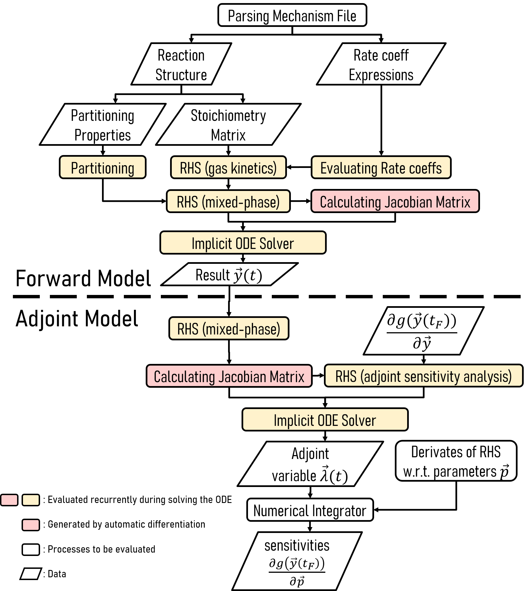

# JlBox

[](https://zenodo.org/badge/latestdoi/140199713)

The `JlBox` is a julia package that simulates the evolution of chemicals in the atmosphere using
box model where advection effect is ignored. It is heavily inspired by Dr. David Topping's [PyBox]
and the two models could produce identical results, but JlBox is ~10x faster
than PyBox. It could handle *full MCM* mechanism (>10k eqns, 5k species) for both gas and mixed phase simulation.

This package works on Julia v1.5 .

## Get Started

### Running on Binder snapshot
Click this button to try JlBox on Binder:

- Dvelopment: [](https://mybinder.org/v2/gh/huanglangwen/JlBox/HEAD?urlpath=lab/tree/example/Demo.ipynb)
- Stable:
  [](https://mybinder.org/v2/gh/huanglangwen/JlBox/v1.1?urlpath=lab/tree/example/Demo.ipynb)

### Running on Docker container
In the root directory, execute `docker build . -t jlbox` to build a docker image
for jlbox, and then 
```
docker run --rm -p 8888:8888 jlbox jupyter lab example/Demo.ipynb --ip=0.0.0.0 --no-browser
```
to open a jupyter notebook with examples of JlBox in it.

### Running on an existing julia environment
Work on Windows, MacOS and Linux.
1. Open julia console, type `]` to enter Package management state.
2. type `dev https://github.com/huanglangwen/JlBox ` to download the JlBox.
3. type `build JlBox` to build JlBox.
4. type `test JlBox` to test its functionality.
5. Exit julia and `cd` into the `JlBox` package folder (normally in `.julia/dev/JlBox`).
6. Run the example using `include("example/Simulation_*.jl")` in julia console.

### Custom Simulation
The `JlBox` package exposes functions like `run_simulation` and
`run_simulation_aerosol_adjoint`. There are three simulation types: gas only
simulation (only gas kinetics process) by passing `GasConfig` to
`run_simulation`, gas-aerosol simulation (gas kinetics+gas-aerosol partitioning)
by passing `AerosolConfig` to `run_simulation` and adjoint sensitivity analysis for the gas-aerosol
simulation. Users could tweak some parameters by changing the Config object as is illustrated in the examples.

## Features
Compared to PyBox, more optimizations are (going to be) added:
- [x] constant folding for rate_values()
- [x] caching rate_values, loss_gain matrix when solving ODE
- [x] jacobian for gas kinetic (analytical)
- [x] jacobian for partitioning process (fine grained AD)
- [x] adjoint sensitivity analysis
- [x] native ode solvers (TRBDF2)
- [x] sparse iterative solver (CVODE_BDF with FGMRES)
- [x] preconditioner (ILU & Tribanded)
- [x] matrix free operator
- [ ] forward sensitivity analysis
- [x] parallel linear solver (for native ODE solver only)
- [ ] parallel version of rate_values, loss_gain and jacobian

## Solver Options
There are two stiff solvers that are practical for solving this model: CVODE_BDF
from Sundials.jl and TRBDF2 from OrdinaryDiffEq.jl. Users have to carefully
choose linear solvers used by them to achieve optimal performance.
- Dense direct linear solver: with `sparse` turned off in `SolverConfig`
    1. `CVODE_BDF(linear_solver=:Dense)`: single thread
    2. `TRBDF2(linsolve=LinSolveFactorize())` [linsolvedoc]: multi-thread
    3. `using CuArrays; TRBDF2(linsolve=LinSolveGPUFactorize())`: GPU parallelized
- Sparse direct linear solver: (not recommended) with `sparse` turned on in
       `SolverConfig`
    1. `CVODE_BDF(linear_solver=:KLU)`
    2. `TRBDF2(linsolve=LinSolveFactorize())`
    3. Pardiso-MKL (in development)
- Sparse iterative linear solver: with `sparse` turned on in `SolverConfig`
    1. `CVODE_BDF(linear_solver=:FGMRES,prec=...,psetup=...,prec_side=2,krylov_dim=...)`:
       FGMRES with right side preconditioner, krylov_dim is suggested to be
       0.1*num_states
    2. `:FGMRES` could be replaced with `:GMRES` or `:BCG` for non-flexible
       GMRES or Bi-Conjugate Gradient Stabilized method but (maybe) with inferior performance.
    3. `TRBDF2(linsolve=LinSolveGMRES())` : (not recommended) hard to update
       preconditioners during simulation

For medium to large simulations (num_states >= 500), iterative methods (currently
only FGMRES in CVODE_BDF is available) generally outperform direct methods. So
for mixed phase simulations, we suggest to use iterative methods with ILU for
initial preconditioning and LU of Tridiagonal for following preconditioning. For
gas only simulations, direct solvers (default in CVODE_BDF and TRBDF2) usually
run faster on small mechanisms like alpha-pinene mechanism.

## Jacobian Options
The `diff_method` in `SolverConfig` are eventually passed to
`select_jacobian(diff_method, ...)` to select the intended jacobian for stiff
ODE solvers. `default_psetup(diff_method1, diff_method2, krylov_dim)` use the
same procedure to determine which jacobian to use when updating preconditioners.
We suggest to use accurate jacobian including coarse/fine-seeding,
fine_analytical for better performance except the second diff_method in psetup
where Tridiagonal preconditioner is less sensitive to the accuracy of jacobian.
However, it is recommended to use "fine_seeding" in adjoint sensitive analysis
as the result depends on the accuracy of Jacobian (explicitly included).
1. "coarse_seeding": `aerosol_jac_coarse_seeding!` naiive implementation of
    automatic differentiation of RHS function, the correctness and accuracy is
    guaranteed natually but memory use and performance is not optimal.
2. "fine_seeding": `aerosol_jac_fine_seeding!` carefully crafted implementation
    only use automatic differentiation in subblocks. It produces identical
    results as the coarse one, but has better performance and uses less
    memory.
3. "fine_analytical": `aerosol_jac_fine_analytical!` implementation of
   analytical solution of Jacobian. It is power and memory efficient. Its
   accuracy is not highly guaranteed but the number of convergence is similar
   to those with automatic difference.
4. "coarse_analytical": `aerosol_jac_coarse_analytical!` highly simplified
   version of analytical solution. It is NOT accurate, only suitable for
   preconditioners.
5. "finite": finite differencing of RHS using FiniteDiff.jl. Slow, not very
   accurate, just for comparison.
6. "gas_v" and "fine_seeding_v": Matrix-free operator version of the respective
   jacobian. Not recommended, as CVODE itself could approximate such operator
   using finite differencing.

There's only one option for gas phase jacobian: `gas_jac!` and all
methods except "finite" one calls `gas_jac!` for analytical solution in gas-only
block.

## Performance tips
- lower tolerance of accuracy gives higher performance
- check accuracy of Jacobian (finitediff vs autodiff vs analytical)
    - Note that coarse_seeding and fine_seeding has the same accuracy, but
      fine_seeding consumes less memory, while coarse_analytical is a very rough
      (and fast) estimation of fine_analytical, the latter is supposed to be accurate.
- or switch to ODE solvers that are less sensitive to the accuracy of Jacobian
    - Low sensitivity: CVODE_BDF, TRBDF2, ABDF
    - Medium sensitivity: KenCarp4, Rosenbrock23 and other Rosenbrock-W methods
    - High sensitivity: Rodas and other Rosenbrock methods
- use parallel linear solvers
    - like default linearsolvers in OrdinaryDiffEq.jl (LinSolveFactorize())
    - or utilise GPU: LinSolveGPUFactorize()
- or use iterative sparse linear solvers (introduced previously)
- use higher krylov dimension when using iterative solvers (~0.1\*num_states,num_states <= num_species\*(1+num_bin))
- use better Preconditioner, but currently ILU and LU of Tridiagonal is
  generally good

## Internals


### How to extend processes
1. Modify the shape of state vector `y` .
2. Modify `dydt!` function adding new processes that effect the derivative of `y` .
3. Choose a suitable way to make a new Jacobian function for the `dydt!` : handwritten analytical function (has the highest potential for optimization but is error prone), generated auto differentiation or finite differentiation. These approaches can be mixed together like in `aerosol_jac_seeding!` where the analytical Jacobian is used for gas kinetics part. Sometimes it is hard to write an accurate (or correct) analytical Jacobian function while generated Jacobian is at least correct and accurate (AD is more accurate than FD). An accurate Jacobian matrix can significantly reduce the iteration steps of implicit ODE solvers.
4. Now you can run the model (remember to `using Revise` at the begining to avoid recompiling of the package everytime you change it).
4. With the Jacobian function, you could get adjoint sensitivity analysis out of box!

[PyBox]: https://github.com/loftytopping/PyBox
[linsolvedoc]: https://docs.sciml.ai/stable/features/linear_nonlinear/#Linear-Solvers:-linsolve-Specification-1
