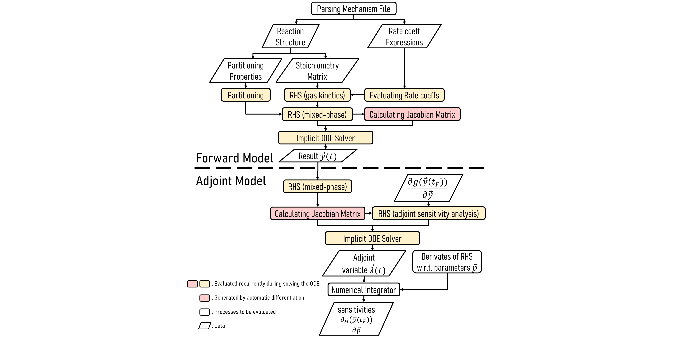

# JlBox

The `JlBox` is a julia package that simulates the evolution of chemicals in the atmosphere using
box model where advection effect is ignored. It is heavily inspired by Dr. David Topping's [PyBox]
and the two models could produce identical results, but JlBox is ~10x faster than PyBox.

This package works on Julia v1.4 .

## Get Started

### Running on an existing julia environment
Work on Windows, MacOS and Linux.
1. Open julia console, type `]` to enter Package management state.
2. type `dev https://github.com/huanglangwen/JlBox ` to download the JlBox.
3. type `build JlBox` to build JlBox.
4. type `test JlBox` to test its functionality.
5. Exit julia and `cd` into the `JlBox` package folder (normally in `.julia/dev/JlBox`).
6. Run the example using `include("example/Simulation_*.jl")` in julia console.

### Custom Simulation
The `JlBox` package exposes functions like `run_simulation_*(config)`. Indicated by the function
name, there are three simulation types: gas only simulation (only gas kinetics process), gas-aerosol simulation (gas kinetics+gas-aerosol partitioning) and adjoint sensitivity analysis for the gas-aerosol
simulation. Users could tweak some parameters by changing the `config` as is illustrated in the examples.

## Features
Compared to PyBox, more optimizations are (going to be) added:
- [x] constant folding for rate_values()
- [x] caching rate_values, loss_gain matrix when solving ODE
- [x] jacobian for gas kinetic (analytical)
- [x] jacobian for partitioning process (fine grained AD)
- [x] adjoint sensitivity analysis
- [x] native ode solvers (TRBDF2)
- [x] sparse iterative solver (CVODE_BDF with FGMRES)
- [x] preconditioner (ILU & Tribanded)
- [ ] forward sensitivity analysis
- [x] parallel linear solver (for native ODE solver only)
- [ ] parallel version of rate_values, loss_gain and jacobian

# Solver Options
There are two stiff solvers that are practical for solving this model: CVODE_BDF
from Sundials.jl and TRBDF2 from OrdinaryDiffEq.jl. Users have to carefully
choose linear solvers used by them to achieve optimal performance.
- Dense direct linear solver: with `sparse` turned off in `SolverConfig`
    1. `CVODE_BDF(linear_solver=:Dense)`: single thread
    2. `TRBDF2(linsolve=LinSolveFactorize())` [linsolvedoc]: multi-thread
    3. `using CuArrays; TRBDF2(linsolve=LinSolveGPUFactorize())`: GPU parallelized
- Sparse direct linear solver: (not recommended) with `sparse` turned on in
       `SolverConfig`
    1. `CVODE_BDF(linear_solver=:KLU)`
    2. `TRBDF2(linsolve=LinSolveFactorize())`
    3. Pardiso-MKL (in development)
- Sparse iterative linear solver: with `sparse` turned on in `SolverConfig`
    1. `CVODE_BDF(linear_solver=:FGMRES,prec=...,psetup=...,prec_side=2,krylov_dim=...)`:
       FGMRES with right side preconditioner, krylov_dim is suggested to be
       0.1*num_states
    2. `TRBDF2(linsolve=LinSolveGMRES())` : (not recommended) hard to update
       preconditioners during simulation

For medium to large simulations (states >= 500), iterative methods (currently
only FGMRES in CVODE_BDF is available) generally outperform direct methods. So
for mixed phase simulations, we suggest to use iterative methods with ILU for
initial preconditioning and LU of Tridiagonal for following preconditioning. For
gas only simulations, direct solvers (default in CVODE_BDF and TRBDF2) usually
run faster on small mechanisms like alpha-pinene mechanism.

## Internals

### How to extend processes
1. Modify the shape of state vector `y` .
2. Modify `dydt!` function adding new processes that effect the derivative of `y` .
3. Choose a suitable way to make a new Jacobian function for the `dydt!` : handwritten analytical function (has the highest potential for optimization but is error prone), generated auto differentiation or finite differentiation. These approaches can be mixed together like in `aerosol_jac_seeding!` where the analytical Jacobian is used for gas kinetics part. Sometimes it is hard to write an accurate (or correct) analytical Jacobian function while generated Jacobian is at least correct and accurate (AD is more accurate than FD). An accurate Jacobian matrix can significantly reduce the iteration steps of implicit ODE solvers.
4. Now you can run the model (remember to `using Revise` at the begining to avoid recompiling of the package everytime you change it).
4. With the Jacobian function, you could get adjoint sensitivity analysis out of box!

[PyBox]: https://github.com/loftytopping/PyBox
[linsolvedoc]: https://docs.sciml.ai/stable/features/linear_nonlinear/#Linear-Solvers:-linsolve-Specification-1
